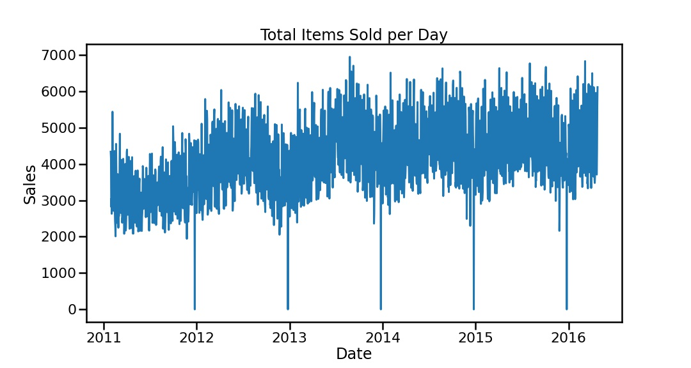
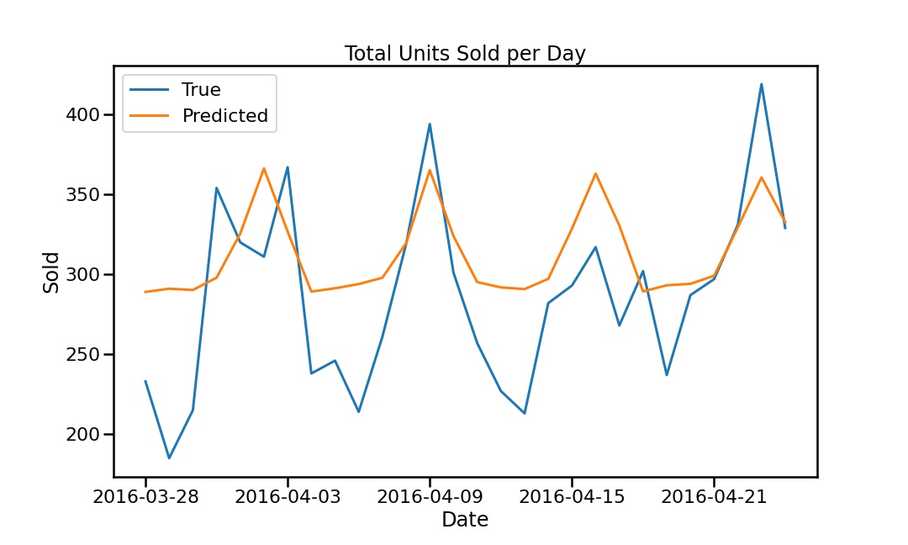
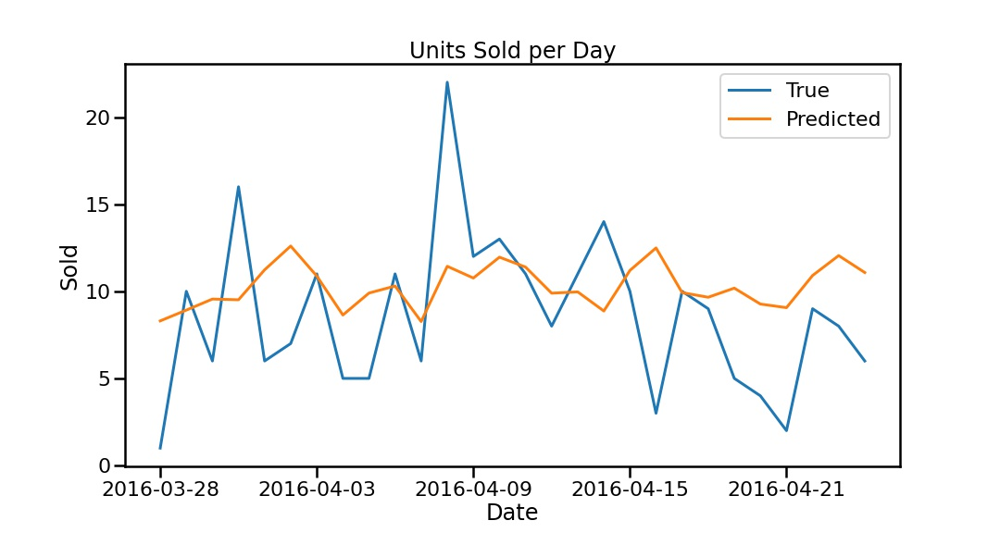

# Forecasting Demand at Wal-Mart Retail Store

### Data

The data needed to run this notebook is too large for github and will need to be downloaded from [Kaggle](https://www.kaggle.com/competitions/m5-forecasting-accuracy/data).

## Business Overview

Predicting demand is one of the most important and difficult aspects of running a retail store. It is critical to have enough of the products that consumers expect to be able to find at the store to be worth their time. However, there is only so much room on the shelves or in storage. Meeting customer demand while not maintaining a cluttered, unmanageable inventory is a difficult balance to find. It is even more difficult given the ever increasing amount of products that retailers are expected to have on hand. One of the main factors that has lead to Wal-Marts success in retail is its efficient supply chain. However, managing these systems requires accurate estimations of demand for all the products in the store. This predictive model will be designed to meet these business needs.

## Data Understanding

This data was aquired from the M5 - Accuracy competition linked above. It included data of daily sales for 3049 unique items across 10 different Wal-Mart stores. There were a few unique challenges that the data presented. For one, the data was highly noisy. This is a graph of the total number of items sold on a daily basis in a Wal-Mart in California. Even after lummping the items together, the number of units sold on daily basis varies greatly.

This high variance is even more noticable for a single item. Given that there are more unique products being sold in supermarkets than ever, many of which compete with each other, sales (or demand) of each individual product will be extremely volatile. A [Consumer Reports article](https://www.consumerreports.org/cro/magazine/2014/03/too-many-product-choices-in-supermarkets/index.htm) found that the average number of unique products sold in supermarkets rose from 9000 products in 1975 to 47,000 products in 2008. This volatility leads to very noisy time series that are challenging to predict. This graph shows the number of units sold per day for a random item in the store. Accurately predicting these intermittent peaks, especially with all the days where zero units are sold can be especially challenging. 

## Modeling

With the aformentioned challenges mentioned, it is somewhat unsurprising that the model had underwhelming results. The final model used a Light Gradient Boosting Machine (LGBM) algorithm, which forecasted the amount of units sold daily for 28 days. It achieved an RMSE of 1.46 units, which did slightly outperform the baseline RMSE of 1.71, but still leaves a lot of room for improvement. The first graph shows a line graph of both the total number of items predicted to sell and actually sold for the entirety of the first food department. You can see the model failed to predict the bottom of the troughs or the top of the peaks on the graph. This pattern held for the most highly sold item as well, as you can see in the second graph.

## Conclusion

While this model ended up not performing particularly well, with more time and knowledge of modeling time series, it could be utilized in many useful ways. The most obvious way would be to use it to predict demand for products to know how many units need to be ordered and sent to distribution centers and stores. However, there are also other creative ways to use a model that accurately predicts demand. You could use it to flag items with increasing or decreasing demand before humans may notice and adjust future orders accordingly. You could also use a model like this to estimate the effect of eye-level shelf space, endcaps, or advertisements on demand for products.

In order to get this model to a state that would be deployable, a few ideas came to mind. Many of the most successful models on Kaggle used the N-BEATS deep learning algorithm to work with data as a time series. While I used lag and moving average features to emulate a time series, I think a more proper tool like N-BEATS or DeepAR would have been more appropriate and accurate. Another feature that would have helped greatly is inventory. While you would not have access to inventory when forecasting, you could put limits on models that could pick up on when items aren't selling due to lack of supply as opposed to lack of demand. This distinction is important when making a model that is assumed to be predicting demand. Lastly, some sort of variable that identified the prominence of a product would be very helpful. A model that could include the effects of different product locations such as being closer to eye level could give a significant edge.

If you would like to read my notebook or look at a presentation I made to further explore my work, please click on the links below.

[EDA Notebook](./1.EDA_Notebook.ipynb)

[Modeling Notebook](./2.Modeling_Notebook.ipynb)

[Presentation](./Presentation.pdf)
